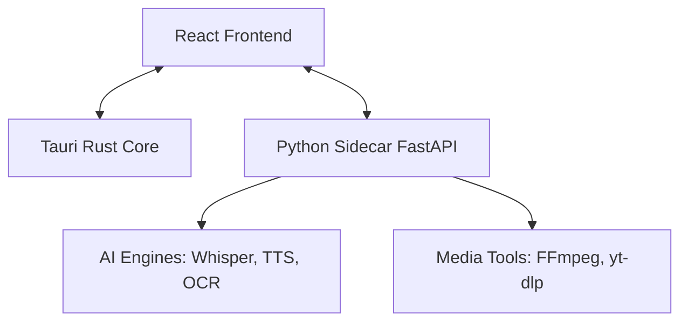

# Architecture - KNReup

KNReup tuân theo kiến trúc **Hybrid Desktop Application** với sự kết hợp giữa hiệu năng của Rust (Tauri), tính linh hoạt của Web (React) và sức mạnh xử lý AI của Python (Sidecar).

## 1. Tổng quan hệ thống

## 2. Các thành phần chính

### A. Frontend Layer (React)
- **Trách nhiệm:** Hiển thị UI, quản lý trạng thái ứng dụng (Zustand), xử lý Timeline và waveform âm thanh.
- **Giao tiếp:** 
  - Gọi Tauri commands cho các tác vụ hệ thống (file dialog, shell).
  - Gọi HTTP API tới Sidecar cho các tác vụ xử lý media/AI.
  - Nhận progress qua SSE từ Sidecar.

### B. Desktop Bridge (Tauri/Rust)
- **Trách nhiệm:** Cung cấp môi trường chạy ứng dụng, quản lý cửa sổ, bảo mật file system.
- **Sidecar Management:** Tauri chịu trách nhiệm khởi động tiến trình Python (`python-sidecar.exe`) khi ứng dụng start và tắt nó khi ứng dụng đóng.

### C. Processing Layer (Python Sidecar)
- **Trách nhiệm:** Thực hiện các tác vụ nặng về tính toán mà JS không hiệu quả hoặc không có thư viện hỗ trợ (Whisper, Voice Cloning, Video Download).
- **Kiến trúc:** FastAPI cung cấp các endpoint RESTful. Các "Engine" được module hóa trong `app/engines/`.

## 3. Luồng dữ liệu quan trọng (Data Flow)

### Tác vụ xử lý Video/Audio:
1. User kéo video vào Timeline.
2. Frontend yêu cầu Sidecar phân tích video (lấy audio, chạy ASR).
3. Sidecar chạy ASR (Whisper) và trả về progress qua SSE.
4. Khi hoàn tất, Sidecar trả về file JSON phụ đề.
5. Frontend cập nhật `useSubtitleStore` và hiển thị lên Timeline.

### Tác vụ TTS & Mix:
1. User chỉnh sửa phụ đề và chọn giọng đọc.
2. Frontend gửi mảng các subtitle tới Sidecar.
3. Sidecar gọi engine TTS (Edge/ElevenLabs) để tạo các file audio nhỏ.
4. Sidecar mix các file audio này vào video gốc (hoặc file audio riêng).
5. Kết quả được trả về đường dẫn file local để Frontend load.

## 4. Quản lý trạng thái (State Management)
- Sử dụng **Zustand** với nhiều store chuyên biệt:
  - `useProjectStore`: Thông tin project hiện tại, video gốc.
  - `useSubtitleStore`: Danh sách phụ đề, thời gian, text.
  - `useVoiceStudioStore`: Cấu hình giọng nói, profiles.
  - `queueStore`: Quản lý các tác vụ đang chạy ngầm.
